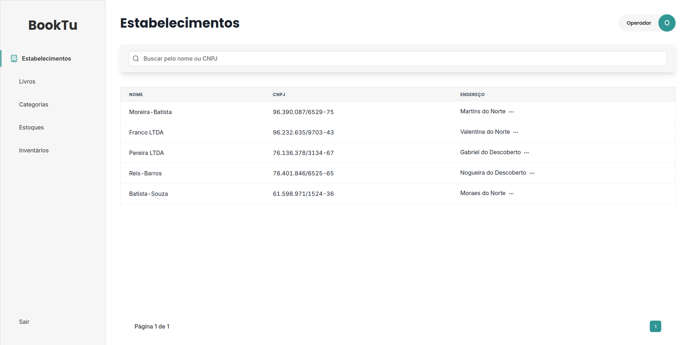
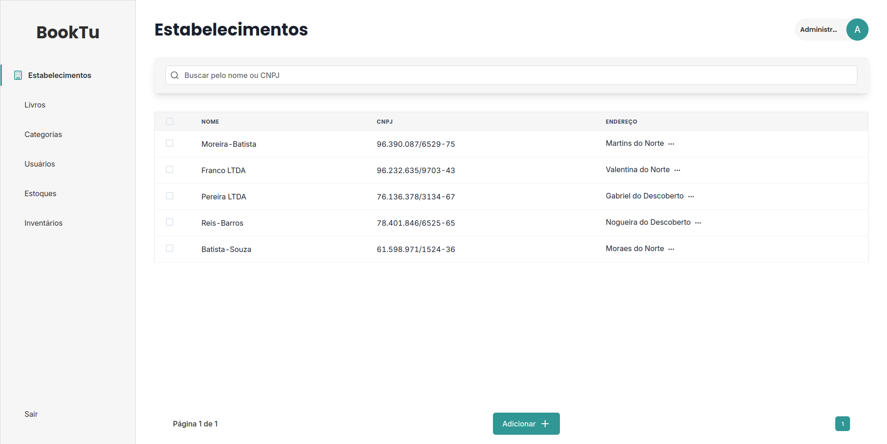

# **BookTu - Sistema de Gestão de estoque de livros**

### Sistema web para gerenciamento de livros, estabelecimentos, estoques e inventários, desenvolvido com Next.js, TypeScript e Chakra UI.

|                  Tela do operador                   |               Tela do administrador               |
| :-------------------------------------------------: | :-----------------------------------------------: |
|  |  |

## 📋 Sobre o Projeto

BookTu é uma aplicação completa para controle de inventário de livros em múltiplos estabelecimentos. O sistema permite o gerenciamento de usuários, livros, categorias, estabelecimentos e inventários, com funcionalidades diferenciadas para administradores e operadores.

## 🛠️ Tecnologias Utilizadas

### Bibliotecas e Frameworks

- **Next.js 12** - Framework React com SSR
- **TypeScript** - Tipagem estática
- **Chakra UI** - Biblioteca de componentes
- **Framer Motion** - Animações
- **React Hook Form** - Gerenciamento de formulários
- **Zod** - Validação de schemas
- **Lucide React** - Ícones
- **TanStack Query (React Query)** - Cache e gerenciamento de estado servidor
- **Axios** - Cliente HTTP
- **Nookies** - Gerenciamento de cookies
- **JWT** - JSON Web Tokens
- **jwt-decode** - Decodificação de tokens

## ✨ Funcionalidades Principais

### 🔐 Autenticação

- Sistema de login com JWT
- Controle de permissões (Admin/Operador)
- Proteção de rotas por autenticação

### 📚 Gerenciamento de Livros

- Cadastro, edição e exclusão de livros
- Associação com categorias
- Busca por título, autor ou identificador
- Filtros e ordenação (A-Z, preço, data)
- Informações detalhadas (título, autor, ano, preço, descrição)

### 🏢 Gerenciamento de Estabelecimentos

- Cadastro completo com dados de endereço
- CNPJ, CEP, cidade, estado, bairro
- Busca por nome ou CNPJ
- Seleção múltipla para ações em lote (apenas admin)

### 📦 Gestão de Inventários

- Criação e edição de inventários
- Associação de múltiplos livros com quantidades
- Processamento de inventários
- Filtro por estabelecimento
- Status (processado/não processado)
- Controle de quantidade total de produtos

### 📊 Controle de Estoque

- Visualização de itens em estoque
- Quantidade por livro e estabelecimento
- Filtros por estabelecimento
- Busca por título do livro

### 👥 Gerenciamento de Usuários (Admin)

- Cadastro e edição de usuários
- Controle de permissões (Admin/Operador)
- Busca por nome ou matrícula
- Filtros por tipo de permissão

### 🏷️ Categorias

- Cadastro e edição de categorias
- Associação com livros
- Ordenação alfabética

## 📁 Estrutura do Projeto

```
src/
├── components/        # Componentes reutilizáveis
├── context/           # Contextos da aplicação
├── hooks/             # Hooks customizados
├── lib/               # Configurações de bibliotecas
├── pages/             # Páginas Next.js
├── services/          # Hooks de API
├── shared/            # Tipos e interfaces TypeScript
└── utils/             # Funções utilitárias
```

## 🚀 Como Executar

### Pré-requisitos

- Node.js 16+
- PNPM, NPM ou Yarn

### Instalação

1. Clone o repositório

```bash
git clone https://github.com/Yan-CarlosIF/BookTu-Backend.git
cd BookTu
```

2. Instale as dependências

```bash
pnpm install
```

3. Clone o backend do projeto e siga as instruções do backend para roda-lo

```bash
git clone https://github.com/Yan-CarlosIF/BookTu-Backend.git

# Siga essas instruções: https://github.com/Yan-CarlosIF/BookTu-Backend?tab=readme-ov-file#execu%C3%A7%C3%A3o-com-docker
```

4. Execute o projeto

```bash
pnpm dev
```

5. Acesse http://localhost:3000

## 🔑 Permissões de Usuário

### Administrador

- Acesso completo a todas as funcionalidades
- Gerenciamento de usuários
- Exclusão em lote de registros
- Processamento de inventários

### Operador

- Visualização de dados
- Cadastro e edição de livros, categorias e estabelecimentos
- Criação e edição de inventários
- Sem acesso ao gerenciamento de usuários

## 🎨 Características Técnicas

### Otimizações

- **SSR (Server-Side Rendering)** para melhor SEO e performance inicial
- **Cache inteligente** com React Query (1 minuto de stale time)
- **Debounce** em buscas para reduzir requisições
- **Paginação** em todas as listagens

### Validação

- Validação de formulários com Zod
- Feedback visual de erros
- Máscaras para CNPJ e CEP

### Segurança

- Tokens JWT em cookies HTTP-only
- Proteção de rotas no servidor
- Verificação de permissões por página
- Redirecionamento automático se não autenticado

## 📝 Scripts Disponíveis

```bash
pnpm dev      # Inicia servidor de desenvolvimento
pnpm build    # Cria build de produção
pnpm start    # Inicia servidor de produção
pnpm lint     # Executa linter
```

---

Desenvolvido com 🧠 para gestão eficiente de estoque.
